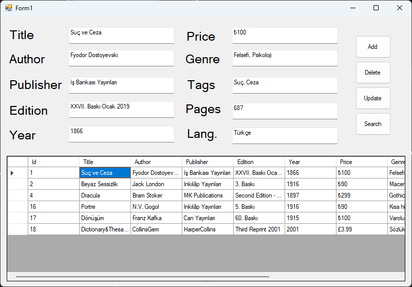

# Library Management



A Windows Forms application for managing a library's book records. The project targets **.NET Framework 4.7.2** and stores its data in Microsoft SQL Server.

## Requirements

- Visual Studio with .NET Framework 4.7.2 targeting pack
- SQL Server or SQL Server Express
- The Entity Framework 6 NuGet package (declared in `packages.config`)

## Database setup

The application expects a database named `LibraryDB` with a `dbo.Books` table. Create the table with the following schema:

```sql
CREATE DATABASE LibraryDB;
GO

USE LibraryDB;
GO

CREATE TABLE dbo.Books
(
    Id        int IDENTITY(1,1) PRIMARY KEY,
    Title     varchar(50),
    Author    varchar(50),
    Publisher varchar(50),
    Edition   varchar(50),
    Year      varchar(50),
    Price     varchar(50),
    Genre     varchar(50),
    Tags      varchar(200),
    Pages     varchar(50),
    Language  varchar(50)
);
```

Update the `LibraryDBEntities` connection string in `App.config` to use the SQL Server instance available on your machine. The checked-in configuration currently points to `DESKTOP-2FRKVQK\SQLEXPRESS` and uses Windows Integrated Security.

## Build and run

1. Open `Library_Management.sln` in Visual Studio.
2. Restore the NuGet packages if prompted.
3. Confirm the database and connection string are configured.
4. Build and run the `Library_Management` project.

## User interface

The main form is laid out with fields for book title, author, publisher, edition, year, price, genre, tags, page count, and language, along with a book grid and Add, Delete, Update, and Search controls. The Add, Delete, Update, and Search event handlers are currently placeholders.
